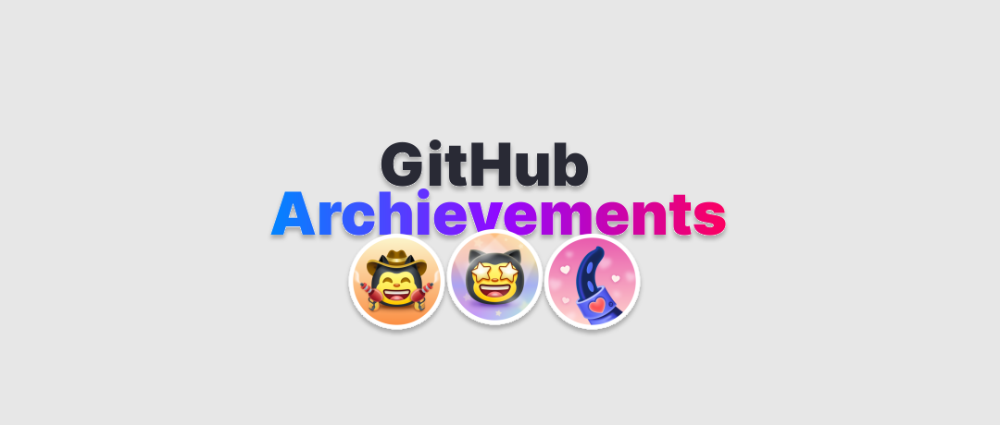

<picture>
  <source media="(prefers-color-scheme: light)" srcset="./assets/badges/Banner.svg">
  
</picture>

# Profile Badges

Complete reference of GitHub Profile Badges with step-by-step guides for earning each one. Includes all earnable badges, tiers, skin-tone variants, and highlight badges.

## Usage

Open [Profile Badges](https://luismede.github.io/profile-badges/) in a browser to browse badges and guides interactively. The sidebar navigation lets you:
- Browse earnable badges and their earning guides
- View badges currently in testing
- See unobtainable badges
- Compare tier progressions (Default, Bronze, Silver, Gold)
- Explore skin-tone variants for Quickdraw
- Browse highlight badges

## Languages

The web app supports English, Portuguese (pt-BR), Spanish, and French.

## Credits

- Credits to [@Schweinepriester](https://github.com/Schweinepriester) for the high quality images, design inspiration and badge information.
- Credits to [@Thinkright20](https://github.com/Thinkright20/) for the inspiration too.

## License

MIT — &copy; 2024 Luis Henrique
